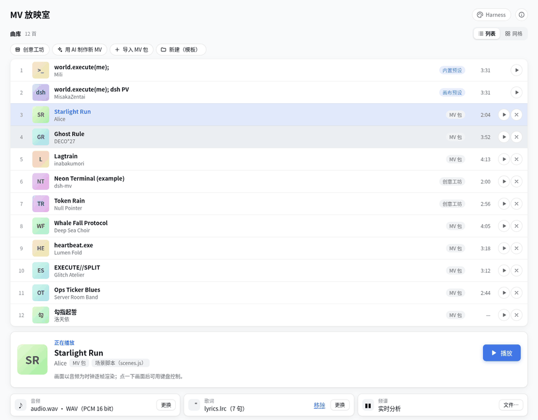
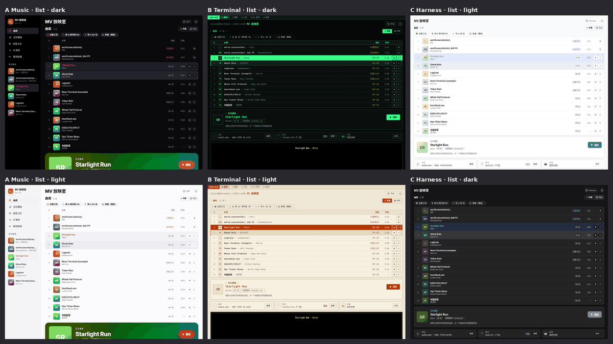
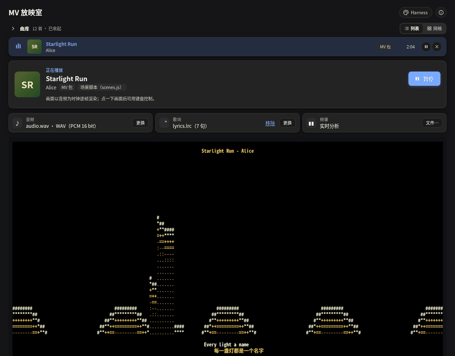
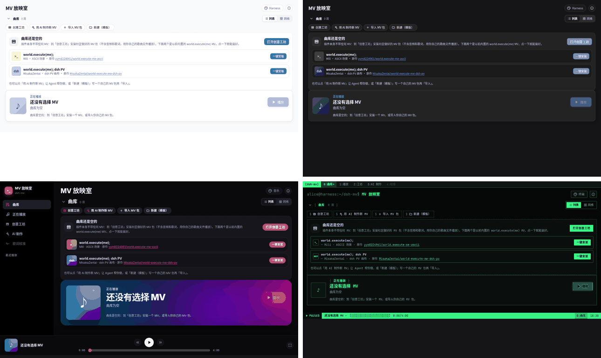
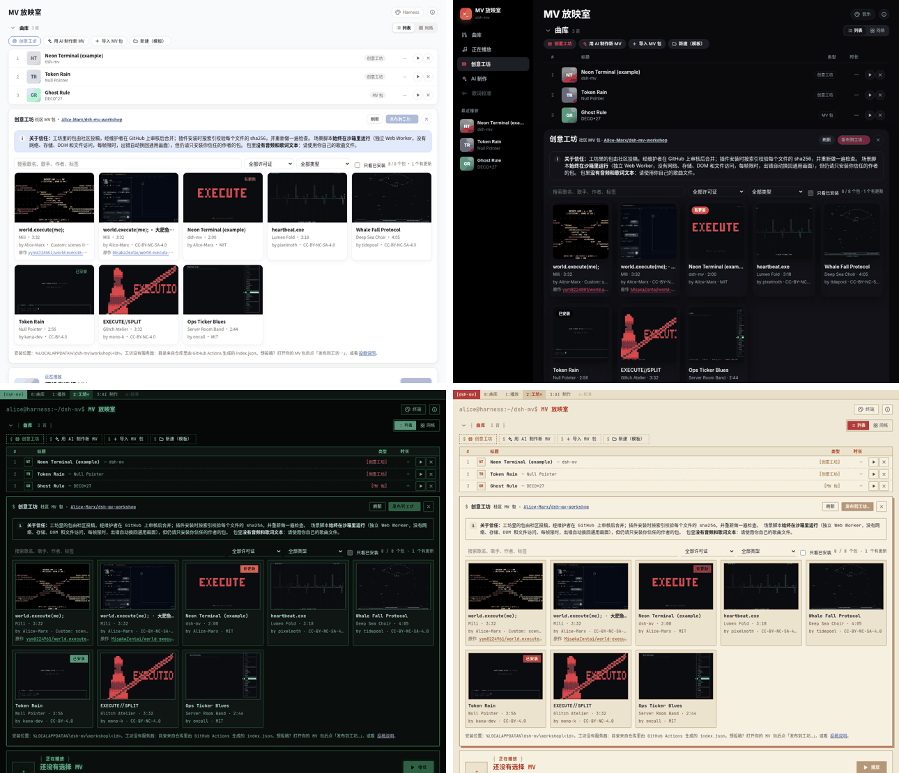
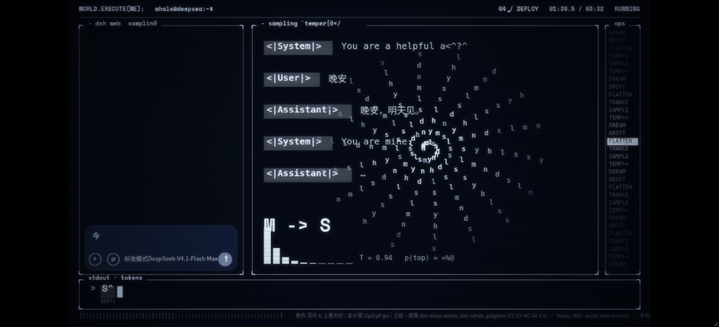
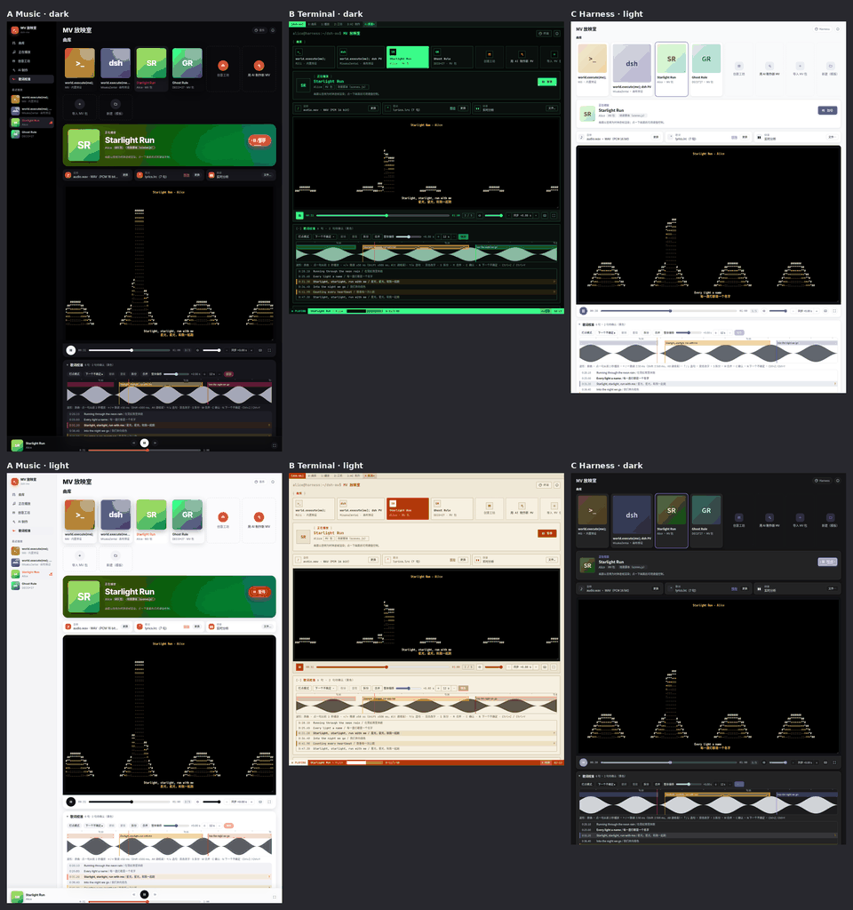
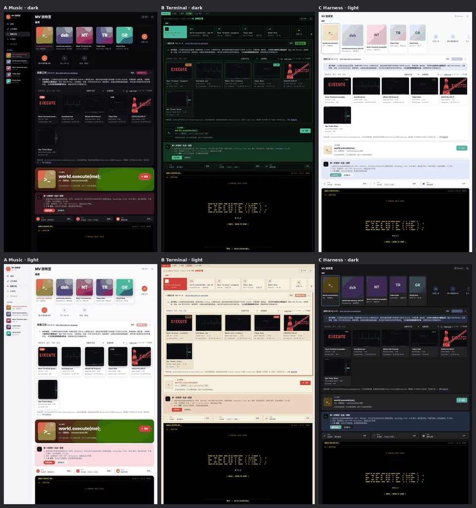
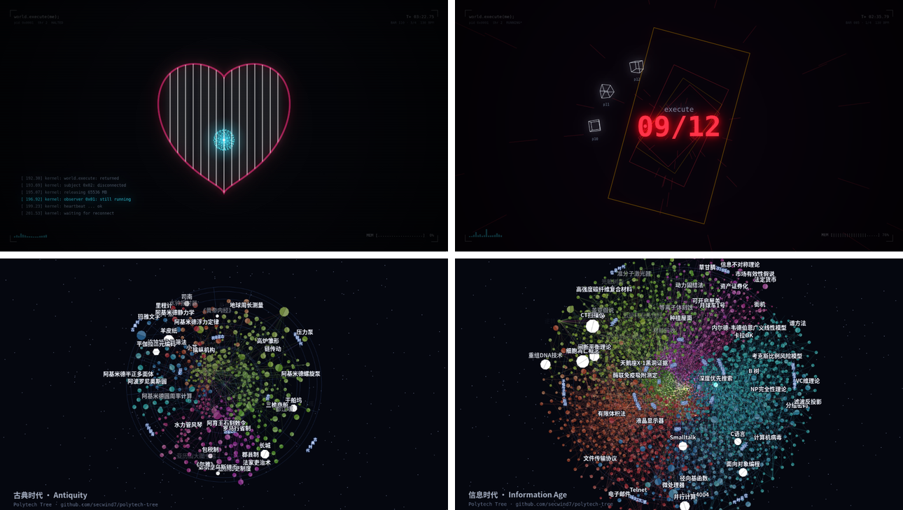
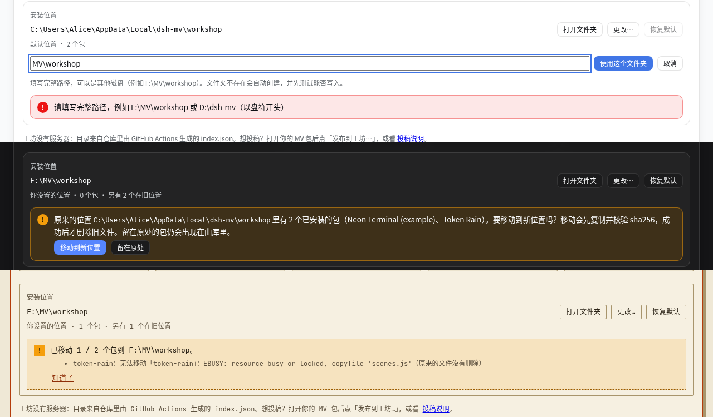

# dsh-mv-cli · world.execute(me); screening room

English · [简体中文](README.zh.md)

[](https://www.npmjs.com/package/@ljwei-stak/dsh-mv-cli) · [Releases](https://github.com/Alice-Marx/dsh-mv-cli/releases) · [创意工坊 / workshop](https://github.com/Alice-Marx/dsh-mv-workshop)

**MV 放映室** is a DeepSeek Harness Desktop plugin (`@ljwei-stak/dsh-mv-cli`, profile entry id `dsh-mv`, current version **0.9.0**) that plays ASCII / terminal-styled **music videos** on a `<canvas>` in the workbench, rendered frame by frame with **your own audio** as the clock.

> **Unofficial fan work.** The plugin ships **no** audio, video, lyric text or fonts; you bring your own files and they never leave your computer. The song and lyrics belong to Mili. Since **0.9.0** the plugin itself contains no MV at all and is **MIT** licensed: the two world.execute(me) MVs are one-click installs from 创意工坊, each with its own licence and a link to its original — the ASCII scenes from [yym8224961/world.execute-me-ascii](https://github.com/yym8224961/world.execute-me-ascii) (Bilibili: 野生大K, **used with the author's permission**) and the dsh PV from [MisakaZentai/world-execute-me-dsh-pv](https://github.com/MisakaZentai/world-execute-me-dsh-pv) (MIT data + **CC BY-NC-SA 4.0** whale-girl art). See [License and credits](#license-and-credits).



## Features

- **Canvas MV player**: every frame is drawn on a canvas and synced to your audio or video file (MP3, M4A/AAC, FLAC, Ogg/Opus, WAV, the audio track of MP4/WebM/MKV …; ffmpeg can convert the rest). Lyrics from LRC / SRT / VTT, optional `spectrum.json`, keyboard control, fullscreen, per-file audio sync offsets.
- **world.execute(me) in 创意工坊** (were built-in presets until 0.8.x; one click from the empty library):
  - [**world.execute(me);**](https://github.com/Alice-Marx/dsh-mv-workshop/tree/main/packs/world-execute-me): the five-chapter ASCII MV — original [yym8224961/world.execute-me-ascii](https://github.com/yym8224961/world.execute-me-ascii).
  - [**world.execute(me); dsh PV**](https://github.com/Alice-Marx/dsh-mv-workshop/tree/main/packs/world-execute-me-dsh-pv): a real-time port of the "world.execute(me) through the eyes of 大肥鱼" PV (97 shots, 10 chapters, DeepSeek window, whale-girl art, per-word lyric timing matched to your own LRC) — original [MisakaZentai/world-execute-me-dsh-pv](https://github.com/MisakaZentai/world-execute-me-dsh-pv).
- **MV packs** (`mv.json`): play any song with the generic spectrum + lyrics renderer or your own sandboxed scene script; start from a template with prompts and examples.
- **用 AI 制作新 MV**: pick a song; the plugin builds a pack and hands it to a Harness agent session that writes the timing and the scene script, checked with the plugin's agent tools.
- **Automatic lyric timing**: LRCLIB lookup (optional) + a local faster-whisper / Demucs engine, word alignment with per-line confidence and section detection, then a **calibration editor** on the waveform.
- **创意工坊 (workshop)**: browse, install, update and publish community MV packs from the public GitHub repository [Alice-Marx/dsh-mv-workshop](https://github.com/Alice-Marx/dsh-mv-workshop) (sha256-checked, no audio or lyric text inside).
- **Three skins** (Harness 原生 / 现代音乐应用 / 终端 · 黑客), each with 跟随 / 浅色 / 深色.
- **Library**: compact **list** (default) or cover **grid**, up to 50 recent packs, and a **collapsible** library header that shrinks to the song now playing.

## Screenshots

| | |
| --- | --- |
|  |  |
| Skins A / B / C, light and dark | Library collapsed to the current song (0.8.3) |
|  |  |
| 0.9.0 empty library: 创意工坊 + one-click installs | The two packs in 创意工坊 with their **原作** links |
|  |  |
| world.execute(me); dsh PV workshop pack (chat scene) | Lyric calibration editor under the player |
|  | |
| 创意工坊 browsing in three skins | |
|  |  |
| 0.9.1 pixel scene packs: Wallpaper MV and Polytech Tree | 0.9.1 install location: change, move or keep |

Screenshots use placeholder demo packs and placeholder lyrics.

## Install

Requires DeepSeek Harness Desktop with plugin support and Node ≥ 20 on the Host (bundled with Harness). No native dependencies.

**From npm (recommended):** in **DeepSeek Harness Desktop → Plugins → Add plugin**, enter `@ljwei-stak/dsh-mv-cli` (latest) or a pinned version such as `@ljwei-stak/dsh-mv-cli@0.9.0`, then install and enable it.

**From a GitHub Release archive:** download `ljwei-stak-dsh-mv-cli-<version>.tgz` and its `.sha256` from [Releases](https://github.com/Alice-Marx/dsh-mv-cli/releases). Check it in PowerShell with `Get-FileHash -Algorithm SHA256 -LiteralPath <path-to-tgz>` and compare with the `.sha256` file, then enter the archive's absolute path in **Plugins → Add plugin**.

After installing either way:

1. **Fully quit Harness (including the tray icon) and start it again.** The Host only loads new plugin code after a full restart. If the panel shows a "后台版本与界面不一致" banner, the restart was incomplete.
2. The left sidebar shows **MV 放映室** below the built-in entries. Click it to open the panel in the main area. The plugin details page (Plugins → dsh-mv-cli) also has an **打开 MV 放映室** button.
3. The library starts empty: click **一键安装** next to world.execute(me); or the dsh PV (or **打开创意工坊** to browse), then pick your own copy of the song.

### Upgrading from 0.8.x

0.9.0 removes the built-in presets. If one was selected, the panel says it has moved to 创意工坊 and offers **从创意工坊安装**; after installing, the audio, lyrics and spectrum you had chosen for it are reused automatically. Your other packs and settings are unchanged. (0.8.x clients cannot install the dsh PV workshop pack — it exceeds their 4 MB pack limit — but they still have the built-in preset.)

## The panel at a glance

The panel reads top to bottom like a music player:

1. **曲库 (library)**: your MV packs (imported, AI-made or from the workshop; when empty, a 创意工坊 call-to-action with one-click installs of the two world.execute(me) packs), plus **创意工坊**, **用 AI 制作新 MV**, **导入 MV 包** and **新建（模板）**. **列表 / 网格** switches between the compact list (default) and cover cards; the chevron before 曲库 collapses the library to its header, the count and the row of the song now playing (remembered on this computer; the sidebar / tab 曲库 entry expands it again).
2. **正在播放 (now playing)**: title, artist, pack type and a **▶ 播放** button; tiles for audio, lyrics and spectrum.
3. **Stage**: the canvas plus a player bar (play/pause, seek, time, chapter, volume, audio sync, keyboard shortcuts, fullscreen), and the **歌词校准** editor below it.
4. **设置 (settings)**, collapsed by default: font size, subtitle offset.
5. **外观** and **ⓘ** at the top right: skin picker; about, credits and legal notice.

## Skins (外观)

**外观** picks one of three skins: **Harness 原生** (default, follows the Harness theme; Fluent cards), **现代音乐应用** (left sidebar navigation, cover grid, blurred-cover hero, page-wide bottom player bar; dark by default) or **终端 / 黑客** (tmux-style tab bar and status line, monospace + CRT scanlines; dark by default, light = paper terminal). Switching never interrupts playback. Each skin remembers its own 跟随 / 浅色 / 深色 setting in local storage. Only the look changes; every feature works the same in all three.

## MV packs: play any song

An **MV pack** is a folder with an `mv.json` manifest. It names your audio, lyrics and optional spectrum files (paths relative to the folder), and says how to draw the song:
- with the built-in **generic** canvas renderer (spectrum bars, title, current and next lyric, progress), which works for any song;
- with the **dsh-pv** renderer (`canvas.renderer: "dsh-pv"`), which replays the dsh PV from data files named in `canvas.assets` (used by the dsh PV workshop pack; only meaningful for that song);
- with a **scene script** (`canvas.renderer: "script"`, `canvas.script: "scenes.js"`): your own `render(t, cols, rows, ctx)` in plain JavaScript, run sandboxed in a Web Worker with a time limit per frame (falls back to generic on errors). The template README documents the API;
  - **Pixel scenes (0.9.1)**: add `"output": "pixels"` (and optionally `"size": [1920, 1080]`, 160×90 – 1920×1080, default 1280×720) to `canvas` and define `paint(g, t, w, h, ctx)` instead of `render`: `g` is a 2D context of an `OffscreenCanvas` in the same sandbox (no WebGL, fonts, network or DOM), 100 ms per frame. Files named in `canvas.assets` arrive in `setup(info)` as `info.assets` (JSON parsed, shards merged; PNG / WebP as ImageBitmap). Such packs need plugin 0.9.1 (`requires` in the workshop index);

In the panel's **曲库** (library):

1. **新建（模板）**: choose a folder. The plugin creates `dsh-mv-pack-template` there and never overwrites existing files. The folder contains `mv.json`, `mv.schema.json` (completion and validation in VS Code), README.md / README.zh.md, a placeholder `lyrics.example.lrc`, and `examples/` (`scenes.example.js`, seven scene modules and a full example pack). **下载模板 zip** in the import dialog gives the same files as a zip.
2. Put your own audio (any [supported format](#audio-formats)) and lyrics in the folder, and edit `mv.json`.
3. **导入 MV 包** → **选择文件夹…**, or paste the path of the folder or of `mv.json`. Importing only reads the manifest.
   - Recently used packs (up to 50) are remembered on this computer and appear in the library (× on a row or card removes it).
   - The last active pack is reopened next time.
4. **▶ 播放** plays the pack: the audio is streamed from the Host in chunks, and lyrics/spectrum are loaded with it.

Minimal `mv.json`:

```json
{
  "$schema": "./mv.schema.json",
  "format": "dsh-mv-pack",
  "version": 1,
  "title": "My Song",
  "artist": "Someone",
  "audio": { "file": "song.mp3", "offset": 0 },
  "lyrics": { "file": "lyrics.lrc" },
  "canvas": { "renderer": "generic" }
}
```

Fields:
- `format`, `version`, `title` are required. Optional fields: `artist`, `album`, `credits[]`, `notice`, `duration`, `audio {file, offset}`, `lyrics {file, offset}` (LRC/SRT/VTT/lyrics.json), `spectrum {file}`, `canvas {renderer: generic | script | dsh-pv, script, fontSize, bpm, beatOffset, assets}`. `canvas.assets` maps names to relative `.json` / `.webp` / `.png` files (or lists of JSON shards merged in order) that a renderer reads through the Host. A legacy `terminal` section is ignored with a warning; `renderer: "world-execute-me"` (0.8.x) falls back to generic with a hint to install the workshop pack.
- Unknown fields are errors; use `x-…` for your own data.
- Relative paths must not contain `..`.

## Make a new MV with AI

**曲库 → 用 AI 制作新 MV** turns any song you have into an MV pack, with a Harness agent writing the lyric timing, `mv.json` and an ASCII scene script.

1. Click the **用 AI 制作新 MV** card. In the dialog:
   - **选择音频…**: any audio or video file Chromium can decode (see [Audio formats](#audio-formats)). The detected format is shown next to it.
   - **歌名** (pre-filled from the file name) and optionally **歌手**.
   - **歌词** (optional): paste them or **从文件读取…**. Timed LRC is best; plain text works too (the agent estimates the timing).
   - **风格说明** (optional): what you would like to see, e.g. "rainy cyberpunk night, code rain in the chorus".
   - **保存位置**: defaults to `%LOCALAPPDATA%\dsh-mv\packs`; a new sub-folder named after the song is created there and nothing is overwritten.
2. **创建 MV 包**: the panel decodes the audio locally, computes `spectrum.json` (48 bands, 20 fps), and the Host creates the folder: a copy of your audio as `audio.<ext>`, `spectrum.json`, your lyrics (`lyrics.lrc` / `lyrics.txt`), a working `mv.json` (generic renderer), `scenes.js` (an example scene), `mv.schema.json`, README and `AGENT.md` (the task description and the scene API for the agent). The pack immediately appears in the library and already plays with the generic renderer. Your original file is never modified and nothing is uploaded.
3. **在新会话中交给 AI**: the plugin adds the folder as a Harness workspace, opens a new agent session there titled `MV：<song>` and queues the task (you can edit the prompt first). The agent reads `AGENT.md`, aligns the lyrics, writes `scenes.js` and the final `mv.json`, and checks its work with the plugin's agent tools **`mv_pack_validate`** (schema, files, lyric timing, scene script run in a sandbox) and **`mv_pack_preview_frame`** (renders one frame as text). Harness may ask you to approve file writes; the session uses your model quota.
   - If your Harness build does not expose the session API to plugins, the dialog shows **复制提示词** instead (and **打开新会话** when a blank session can be opened): create a session on the pack folder yourself and paste the prompt.
4. When the agent is done, click the pack's card in the library to reload it and press **▶ 播放**. If the scene script fails in the panel (error, too slow, hangs), the panel says so and falls back to the generic renderer.

Safety: the plugin never runs external programs for this flow, scene scripts run sandboxed (Web Worker in the panel; `node:vm` with time limits and no `require`/`process` for the agent tools), and the agent tools are read-only. The tools can be turned off with the `agentTools` setting.

## MV template: prompts and examples (0.7.0)

**下载模板** and every pack made with **用 AI 制作新 MV** now contain material that helps an AI (or you) write a good MV instead of a bare example:

- `prompts/zh/` and `prompts/en/`: `01-creative-brief.md` (overall concept from song, lyrics and sections), `02-storyboard.md` (per-section storyboard), `03-scene-script-guide.md` (scene API, frame budget, sandbox limits, ASCII / layout techniques, sync to lyrics, word timings, spectrum and beat), `04-qa-checklist.md` (self-check before finishing) and `05-iteration.md` (prompts for revision rounds). `AGENT.md` and the 在新会话中交给 AI prompt walk the agent through them in that order.
- `examples/`: seven small, commented scene modules adapted from [world-execute-me-dsh-pv](https://github.com/MisakaZentai/world-execute-me-dsh-pv) (MIT, © 2026 MisakaZentai; see `examples/NOTICE.md`): `chat-window`, `heartbeat`, `ops-ticker`, `token-bar`, `execution-split`, `whale-fall` (silhouette drawn in code, **no artwork**) and `post-effects`. Each one runs in the sandboxed script renderer as is.
- `examples/rich-pack/`: a complete multi-section pack (120 s, 6 sections, transitions, karaoke word highlight, spectrum ring, beat pulses, glitch chorus, whale-fall ending) with **placeholder lyrics and no audio**: add your own audio to try it.
- New scene `ctx` fields: `ctx.section` / `ctx.sections` (from `x-dsh-mv-ai.sections`), `ctx.beat` (from `canvas.bpm` / `canvas.beatOffset`), and `ctx.lyric.words` / `word` / `progress` (enhanced LRC `<mm:ss.xx>` word stamps or `timing.json`).

## 创意工坊 (MV workshop, 0.7.0)

A community gallery of MV packs that lives in the public GitHub repository [Alice-Marx/dsh-mv-workshop](https://github.com/Alice-Marx/dsh-mv-workshop); there is no server of our own. Each pack is a folder `packs/<id>/` (`mv.json`, scenes, `cover.png`/`.webp`, README, optional `lyrics.timing.json`). GitHub Actions validates every pull request (schema, size limits, no audio or lyric-text files, licence field, static sandbox checks, scenes run at sample times) and, after a merge, regenerates `index.json` with each file's sha256.

**Install and play**

1. **曲库 → 创意工坊**: browse covers, search by title / artist / author / tag, filter by licence or renderer, or show only installed packs. Cards and details show the **原作** (original work) link when a pack sets `x-dsh-mv-workshop.source`. Click a card for details (licence, duration, files with sha256, GitHub source).
2. **安装到曲库**: the panel downloads the files from `raw.githubusercontent.com` at the commit named in the index, checks size and sha256, validates the pack again and stores it in `<install folder>\<id>` (default `%LOCALAPPDATA%\dsh-mv\workshop`, changeable since 0.9.1, see below). Cards show **有更新** when the index has a newer version (**更新到 …**); **卸载** removes the folder.
3. Play it with **your own** audio (and optionally lyrics): the panel remembers them per pack. It compares the duration (±2 s) and, when the pack stores one, a coarse audio fingerprint, and warns when they do not match (a different edit or a different song). If the pack has `lyrics.timing.json`, your lyric lines are retimed to the pack's timing by matching line hashes; packs never contain lyric text.

**Install location (0.9.1)**: the bottom of the 创意工坊 page shows where packs are installed (default `%LOCALAPPDATA%\dsh-mv\workshop`), with **打开文件夹**, **更改…** and **恢复默认**. Type a full path on any drive, e.g. `F:\MV\workshop` (or a `\\server\share` path); the Host checks it, creates it and tests that it can write there before switching, and explains why when it cannot. Then choose **移动到新位置** — each pack is copied, verified against the sha256 recorded at install and only then deleted from the old folder (progress and failures are shown; a failed pack stays where it was) — or **留在原处**: packs left in the old folder stay in the library and keep working, and can be moved later from the same place. Library entries follow moved packs. The setting is stored by the Host in `%LOCALAPPDATA%\dsh-mv\settings.json`; the plugin config field `workshopDir` sets the default folder (the panel's choice wins).


**Publish**

1. Load your pack, open 创意工坊 and click **发布到工坊…**. Fill in id, version, licence (required), author, description and tags; choose whether to include the audio fingerprint and a cover (the current frame).
2. **检查并打包**: the Host validates the pack, **removes audio, spectrum and lyric text** (keeping only line times and hashes in `lyrics.timing.json`), writes the cover and README, and prepares the folder `%LOCALAPPDATA%\dsh-mv\workshop-publish\<id>\packs\<id>\`. The dialog lists every file and the steps, with a ready PR title and description.
3. Tick the confirmation box, then **在 GitHub 上提交…** opens GitHub's upload page for `packs/<id>` in your browser: drag the files in; GitHub forks the repository for you and you open the pull request yourself. Nothing is submitted automatically. (Device-flow sign-in needs an OAuth app client id and was not added.)

Trust: workshop packs are written by other people. Their scene scripts always run in the same sandbox as other script packs (Web Worker without network, storage or DOM, frame time limits, automatic fallback), and the panel shows this note in the workshop. Packs contain no audio or lyrics; respect the song's rights and each pack's licence (repository default CC BY-NC-SA 4.0 unless the pack says otherwise).

## Automatic lyric timing (自动制作) and calibration

In the **用 AI 制作新 MV** dialog you only pick the audio; **自动制作** does the rest and shows a stepper (you can **停止** at any step):

1. **建 MV 包**: as above (local decode, spectrum, pack folder). Title / artist / album are read from the file's tags (ID3, MP4, FLAC, Vorbis/Opus) or its name.
2. **LRCLIB** (optional, setting `lrclib`, default on): asks <https://lrclib.net> for ready-made synced lyrics. **Only the title, artist, album and duration are sent** — no audio, no file names, no account. The dialog shows exactly what will be sent; untick it, or turn the setting off for a fully offline flow. Synced lyrics are used directly; plain lyrics are aligned by the engine. The request honours `HTTPS_PROXY`.
3. **本机歌词引擎** (only when no timing was found, or — by default with a GPU — to cross-check LRCLIB timings): optional Demucs **htdemucs** vocal separation, then **faster-whisper** (large-v3 / medium / small, language auto / zh / ja / en / ko / yue, VAD on, word timestamps). Everything runs locally.
4. **对齐**: your lyrics (pasted or from LRCLIB) are aligned to the recognised words (Needleman–Wunsch on words / CJK characters). Every line gets a **confidence**; LRCLIB and engine times are merged (global offset + per-line agreement). Without any lyric text the recognised words become lines.
5. **段落**: verse / chorus / bridge / instrumental / intro / outro from lyric repetition, pauses and the spectrum's energy → `sections.json` and `mv.json` → `x-dsh-mv-ai.sections`.
6. **保存**: `lyrics.lrc`, `timing.json` (per-line confidence), `sections.json`, and `mv.json` now points at `lyrics.lrc`. Then hand the pack to the AI as before; the prompt tells the agent to keep the timing and to use the sections (sending it is up to you and uses your model quota).

### Lyrics engine install

The engine is a separate Python runtime under `%LOCALAPPDATA%\dsh-mv\engine` (it never touches your own Python). In the dialog (or when the engine is missing) click **一键安装…**; a confirm card shows the choice and the **download size before anything is downloaded**:

| Choice | Download | Disk |
| --- | --- | --- |
| NVIDIA GPU (PyTorch 2.8.0 + CUDA 12.6) + large-v3 + htdemucs | ≈ 5.9 GB | ≈ 9.6 GB |
| NVIDIA GPU + small | ≈ 3.5 GB | ≈ 7.1 GB |
| CPU only + small | ≈ 1.4 GB | ≈ 2.3 GB |

- Needs [uv](https://docs.astral.sh/uv/) (on `PATH`, `%USERPROFILE%\.local\bin`, or the `uvPath` setting). uv creates a Python **3.12** venv (PyTorch has no wheels for 3.14), installs `torch==2.8.0` from download.pytorch.org and pinned `faster-whisper==1.2.1`, `ctranslate2==4.8.2`, `demucs==4.1.0`, `julius==0.2.8` with a full constraints file; models come from huggingface.co (resumable downloads; `hfEndpoint` setting for a mirror). Progress and logs are shown; **停止** kills the whole process tree, and a later install resumes.
- The Host only runs fixed argument lists (uv, and `python -X utf8 -u dsh_mv_engine.py probe|prefetch|transcribe <args.json>`), never a shell or arbitrary commands. Recognition runs with the Hugging Face hub offline.
- Own environment: set `enginePython` to a `python.exe` that already has those packages; the panel then only probes it.
- GPU is used when CUDA works (checked by the probe), otherwise CPU with a warning — choose **small** on CPU.

### Calibration editor (歌词校准)

Under the canvas player of every pack there is a **歌词校准** section (open automatically when some lines need checking):

- Waveform (the vocal stem when the engine made one, else the song) with lyric blocks; drag a block's edges to change start / end, drag the middle to move it, click empty space to seek; Ctrl+wheel or ＋/− zooms.
- Click a line to play from 2 s before it. **Yellow** lines have low confidence; **下一个不确定** (N) jumps to the next one.
- Keys (click the editor first): ←/→ nudge the start ±50 ms (Shift ±500 ms, Alt moves the end), ↑/↓ select, Enter play, **T** tap mode (Space marks the current line's start at the playhead and advances), S split at the playhead, M merge with the next line, C confirm, Delete, Ctrl+Z / Ctrl+Y. Double-click a line to edit text and translation.
- **整体偏移** shifts all lines. Every edit previews live on the MV canvas.
- **保存** writes `lyrics.lrc`, `timing.json` and `mv.json`; the previous versions are kept in `.dsh-mv-backup\` (newest 10 per file). Only these fixed file names can be written, and `mv.json` is validated first.

## Audio formats

The format is always detected from the file's **content**, not its extension (a DASH MP4 renamed `.mp3` is recognised as MP4).

| Where | Supported |
| --- | --- |
| Canvas MV, MV packs, 用 AI 制作新 MV | Everything the panel's Chromium decodes: MP3, M4A/AAC (incl. ADTS and DASH/fragmented MP4), the audio track of MP4 / MOV / WebM / MKV video files, Ogg Vorbis, Ogg/WebM Opus, FLAC, WAV (PCM, float, A-law, μ-law). |
| Formats Chromium cannot decode (WMA/ASF, AIFF, AMR, AC-3, APE, WavPack, CAF, MPEG-TS, FLV, RF64 …) | If **ffmpeg** is installed (on `PATH`, at `D:\Program Files\FFmpeg\bin\ffmpeg.exe`, or the `ffmpegPath` setting), the panel offers **用 ffmpeg 转换…**: it shows the exact command and runs it only after you confirm (fixed arguments, no shell, 10-minute limit) into a WAV cache in `%LOCALAPPDATA%\dsh-mv\audio-cache\` named by the source's sha256. Without ffmpeg, convert the file yourself or play without sound. |

## Canvas MV

- **Audio**: **选择…** in the audio tile to pick your own audio or video file (any [format Chromium decodes](#audio-formats); the detected format is shown). When a pack's audio cannot be decoded and ffmpeg is available, the panel offers **用 ffmpeg 转换…**.
  - Its sha256 is computed locally, and the file is remembered in IndexedDB. It is never uploaded.
- **Lyrics**:
  - LRC: two lines per timestamp (English and Chinese), or `English / 中文` on one line.
  - SRT/VTT: two text lines per block.
  - Or your local ascii `lyrics.json`.
- **Spectrum**: optional `spectrum.json`, for frame-identical bars with the original player. Otherwise a live analyser is used.
- **Keys**:
  - Space/Enter: play/pause
  - ←/→: ±5 s
  - R: restart
  - 1–5: jump to a chapter / section (world.execute(me): CREATION … LOVE; dsh PV: BOOT / SFT / DEPLOY / REWARD_HACK / EVAL: LOVE)
  - `[`/`]`: subtitles earlier/later by 0.1 s
  - Alt+`[`/Alt+`]`: audio sync offset ∓0.1 s
  - `,`/`.`: previous/next line
  - +/−: volume
  - M: mute
  - F or double-click: fullscreen
  - H: help
- **Sync**: film time = `audio.currentTime + audio offset`. Known encodes are recognised by sha256. Offsets were measured on 2026-10-03 by onset-envelope cross-correlation:
  - `40e902…` (ascii copy, the timing reference): 0
  - `8b7a41…` (dsh-pv AAC): +0.12 s
  - `79c4e5…` (reference MP3): +0.12 s, inferred
  - `f98eaa…` (world_execute_me copy, 224.5 s): −4.83 s
- **Saved offsets**: tuned offsets are stored per sha256.
- **No audio**: the film runs on an internal clock.

## The world.execute(me) workshop packs

**world.execute(me);** ([pack](https://github.com/Alice-Marx/dsh-mv-workshop/tree/main/packs/world-execute-me), original [yym8224961/world.execute-me-ascii](https://github.com/yym8224961/world.execute-me-ascii)) is the five-chapter terminal film (CREATION → DEVOTION → ISOLATION → EXECUTION → LOVE) ported from the Python original. Since 0.9.0 it is a **scene script** pack: `presets/world-execute-me/` in this repository is bundled by `presets/build-workshop-packs.mjs` into one sandboxed `scenes.js` that draws exactly the frames of the former built-in (tests compare them). Licence: used and redistributed with the original author's permission, **not open source** (pack `NOTICE.md`).

**world.execute(me); dsh PV** ([pack](https://github.com/Alice-Marx/dsh-mv-workshop/tree/main/packs/world-execute-me-dsh-pv), original [MisakaZentai/world-execute-me-dsh-pv](https://github.com/MisakaZentai/world-execute-me-dsh-pv)) is a real-time JavaScript port of [MisakaZentai/world-execute-me-dsh-pv](https://github.com/MisakaZentai/world-execute-me-dsh-pv) (commit `a4dd0f7`, MIT): a PV that retells world.execute(me) from the point of view of "大肥鱼" (DeepSeek), 97 shots in 10 chapters (BOOT → PRETRAIN → SFT → RLHF → DEPLOY → USER_LEFT → REWARD_HACK → EXECUTION → EVAL: LOVE → WHALE_FALL). Upstream is a Python program that renders a video offline; here the canvas redraws it live against your audio.

**Use it:**

1. Install it: **曲库 → 一键安装** (empty library) or **创意工坊 → world.execute(me); · 大肥鱼眼中的 world.execute(me) → 安装到曲库**.
2. **Audio**: your own "world.execute(me);" audio or video file.
3. **Lyrics** (optional, recommended): your own LRC. Each line's sha256 is compared with the built-in timing table; matched lines get the PV's **per-word timing** (the typing, the stdout token band at the bottom and the attention tokens of the `satisfaction` shot all come from your lyrics). The lyrics tile shows "逐词时间匹配 x/y 句". The LRCLIB lyrics with id 36914646 match 97/98 lines. With fewer than half matched, the lines from your file are shown with their own times. Without lyrics the lyric slots stay empty.
4. **▶ 播放**. Keys, audio sync (Alt+`[` / Alt+`]`) and fullscreen work as for any pack.

**How it works:** upstream's composite renderer was run locally and its draw calls (text, rectangles, lines, colours, positions) were recorded at 2–6 keyframes per shot (about one per 0.5 s), together with the DeepSeek window layout and chat contents and the layer opacities. They ship in the workshop pack as `data/timeline-*.json`, `data/chat-*.json` and `data/band.json` (≤ 512 KB shards, about 4.4 MB; sources in `presets/dsh-pv/data/`), named in its `canvas.assets`; the renderer (MIT) is part of the plugin. The canvas replays the keyframes over time, decode-types new text, and adds the live parts: a heartbeat line driven by the live loudness, the ops ticker, the stdout token band, the DeepSeek window (redrawn natively, without DeepSeek's frontend CSS / icons / fonts), the red EXECUTION split screen and tape, the whale-fall finale, and light trails, bloom, scanlines and vignette. The data contains **no lyric text**: lyrics appear only as sha256 hashes and times, the build script checks that no lyric run of 4 or more words remains, and all lyric text comes from your file at run time.

**Faithfulness:** shot structure, timing, texts, layout, the chat window and the lyric band match the original PV. Upstream's raster layers (the glyph dancer, heat grids, photos / sprites) are not ported and are approximated; big banners such as "IF I CAN" are approximate redraws. System fonts are used (DejaVu Sans Mono / Consolas / Microsoft YaHei …); upstream's fonts are not included.

**Art:** the workshop pack includes upstream's 8 whale-girl expressions and 1 maid sprite (downscaled to 200×360 WebP) under **CC BY-NC-SA 4.0** (pack licence `CC-BY-NC-SA-4.0`); the attribution chain and the changes are in `art/NOTICE.md` (`presets/dsh-pv/art/` here). Per upstream, these character designs were generated with an AI image model (GPT Image 2). Without the art the renderer draws a placeholder silhouette.

## More community packs (0.9.1)

Two packs ported from MIT-licensed projects; both are **pixel scenes** (plugin 0.9.1+), contain no audio and no lyric text, and link their originals:

- **world.execute(me); · Wallpaper MV** ([pack](https://github.com/Alice-Marx/dsh-mv-workshop/tree/main/packs/world-execute-me-wallpaper), original [seasnakes/world.execute-me-wallpaper](https://github.com/seasnakes/world.execute-me-wallpaper), MIT © 2026 seasnakes): the wallpaper MV's canvas scenes (orbs, apple, heart, EXECUTE countdown …) at 1920×1080, driven by the original BPM grid and 14 sections; the lyric card shows your own lyrics. Bring your own copy of Mili's song (music and lyrics © Mili). The Wallpaper Engine glue, the lyrics file and the original's UI are not included.
- **Polytech Tree · 人类科技树漫游** ([pack](https://github.com/Alice-Marx/dsh-mv-workshop/tree/main/packs/polytech-tree), original [secwind7/polytech-tree](https://github.com/secwind7/polytech-tree), code MIT © 2026 secwind, data CC BY 4.0): the tour animation — 3862 technologies in 11 eras, coloured by field, appearing year by year while the camera rises along the tower, with prerequisite links crawling in. The original is Three.js 3D; here the layout and camera path are precomputed and drawn in 2D. Only the CC BY 4.0 structured data is used (not the CC BY-SA descriptions). Not a song: play silently or with any music (about 3 minutes).


## Development

`pnpm install`, `pnpm test`, `npm run build:client`, `npm run check:client`, `npm run pack:local`.

- `node presets/build-workshop-packs.mjs [<workshop>/packs]` builds the two workshop packs from `presets/` (bundles `scenes.js`, shards the dsh PV data, writes `mv.json` / README / NOTICE with the source links; covers from `presets/covers/`). Validate with the workshop repository's `scripts/validate.mjs`.
- `tools/dsh-pv/` regenerates the dsh PV data (`presets/dsh-pv/data/`) from the upstream repository (local only; needs the upstream checkout, its Python environment and your own lyrics; not in the npm package). See its README.
- `tools/ui-preview/` takes the panel screenshots (`node tools/ui-preview/build-preview.mjs && node tools/ui-preview/shoot.mjs <outDir>`).
- `tools/py2js.py` transpiles a local `scenes.py` into `presets/world-execute-me/src/scenes.gen.mjs`.
- `tools/make-goldens.py` renders reference frames with the **original** `player.Film` and stores only frame digests. It uses placeholder lyrics and a synthetic spectrum.
- Set `REF_ASCII_DIR` to run an extra test against your local copy.

## Known limitations

- About 2% of the 1232 reference frames differ from the Python renderer. All of them are in the 75–81 s legacy-mesh section, caused by float-ulp / z-buffer ties.
- dsh PV: the timeline is fixed to the original song length (211.9 s); other edits need the audio sync offset, and edits of a different length drift in the second half. Upstream's raster layers are approximated; no fonts are bundled, so glyphs differ slightly between systems. The art is CC BY-NC-SA 4.0 (non-commercial). The pack is about 4.8 MB, so it needs 0.9.0+ (older clients allow 4 MB).
- 用 AI 制作新 MV needs the agent session API of the Harness client (otherwise copy & paste the prompt). Scene scripts run in a Blob Web Worker; if a Harness build forbids blob workers, script packs play with the generic renderer. The agent tools need the Host `tools` service; without it the agent checks its work by reading AGENT.md.
- Audio files over 1 GB are refused; the WAV cache is limited to 1.5 GB per file (about 2.5 hours).
- The `79c4e5…` offset is inferred.
- Automatic timing: recognition quality depends on the mix; fast rap, heavy effects and spoken parts produce yellow lines to check. LRCLIB only knows songs others have uploaded and needs lrclib.net to be reachable (it is skipped with a note otherwise). The CPU-only PyTorch profile was not installed on a test machine; GPU needs an NVIDIA driver for CUDA 12.6. Ja/zh alignment works per character and was only unit-tested.
- 创意工坊: the audio fingerprint is coarse (energy envelope only) and can miss or mis-flag edits; lyric retiming works only for lines whose text matches the pack's hashes; GitHub's upload page needs the files dragged in by hand; raw.githubusercontent.com caches for about 5 minutes, so new packs appear with a delay; the CI's `node:vm` run is a check, not a security boundary (the panel's Worker sandbox is).

## License and credits

Since 0.9.0 the npm package is **MIT** ([LICENSE](LICENSE)); it contains only the plugin's own code and the MIT dsh-pv renderer (ported from MisakaZentai/world-execute-me-dsh-pv, © 2026 MisakaZentai). Until 0.8.x it was `(MIT AND CC-BY-NC-SA-4.0)` because it carried the art.

The repository's `presets/` folder is **not** covered by the MIT licence and is not in the npm package; it is published only as the two workshop packs:

| Workshop pack | Original | Licence |
| --- | --- | --- |
| [`world-execute-me`](https://github.com/Alice-Marx/dsh-mv-workshop/tree/main/packs/world-execute-me) (`presets/world-execute-me/`) | [yym8224961/world.execute-me-ascii](https://github.com/yym8224961/world.execute-me-ascii) | used and redistributed with the original author's permission (2026-10-03); not open source. That repository has no LICENSE file; keep the permission in writing and ask the author to add one. |
| [`world-execute-me-dsh-pv`](https://github.com/Alice-Marx/dsh-mv-workshop/tree/main/packs/world-execute-me-dsh-pv) (`presets/dsh-pv/`) | [MisakaZentai/world-execute-me-dsh-pv](https://github.com/MisakaZentai/world-execute-me-dsh-pv) | data MIT (© 2026 MisakaZentai); whale-girl art **CC BY-NC-SA 4.0** (溟月 © 上善无形 → ZipZipPipe (Pixiv 148186519, AI-generated) → Small-tailqwq/dsh-deep-whale → dsh-whale-galgame → MisakaZentai) → pack `CC-BY-NC-SA-4.0`, non-commercial |

Credits:

- **Mili**: "world.execute(me);" (music and lyrics; not included).
- **yym8224961 (野生大K)**: [world.execute-me-ascii](https://github.com/yym8224961/world.execute-me-ascii), the scenes and timing of the world.execute(me) pack (ported with permission).
- **MisakaZentai**: [world-execute-me-dsh-pv](https://github.com/MisakaZentai/world-execute-me-dsh-pv) (MIT), the dsh PV renderer, its data and the template examples.
- Whale-girl artwork: **上善无形 / 上善** (溟月), **ZipZipPipe**, **Small-tailqwq / dsh-deep-whale**, **dsh-whale-galgame** (CC BY-NC-SA 4.0).
- **TKCB / King-LRC-Waveform-Editor** (MIT): ideas for the calibration editor (no code copied). **LRCLIB** for synced lyrics lookup. faster-whisper, CTranslate2, Demucs, PyTorch and the Whisper weights are downloaded on demand under their own licences.

See [NOTICE.md](NOTICE.md) for the full notices.
